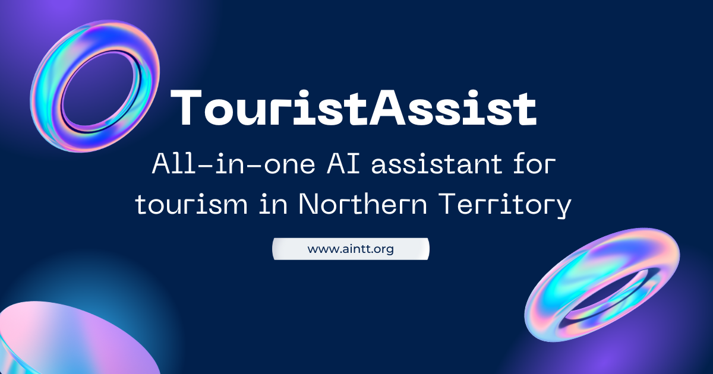

# TouristAssist



TouristAssist is an all-in-one AI assistant for tourism in the Northern Territory, Australia. This project is currently under development and was created for GovHack 2024.

**Project Showcase:** [TouristAssist on GovHack Hackerspace](https://hackerspace.govhack.org/projects/touristassist)

**Website:** https://www.aintt.org/

## Features

- AI-powered question answering system for tourism information
- Multi-language support for questions and responses
- Location-aware responses for place-specific queries
- Official information provided in formatted text, images, and links
- Curated list of common questions for quick access
- Follow-up question suggestions for further exploration
- Cultural stories and information about the Northern Territory
- Information about local services and amenities
- Emergency information in multiple languages
- Interactive user interface for seamless communication

## Getting Started

### Prerequisites

- Node.js 18.16.0 or higher
- pnpm package manager

### Installation

1. Clone the repository:
   ```bash
   git clone https://github.com/your-username/touristassist.git
   cd touristassist
   ```

2. Install pnpm globally (if not already installed):
   ```bash
   npm install -g pnpm
   ```

3. Install project dependencies:
   ```bash
   pnpm install
   ```

4. Set up environment variables:
   - Copy `.env` file
   - Fill in the required credentials (contact the project maintainer for access)

### Running the Application

Start the development server:

```bash

pnpm run dev
```

The application will be available at `http://localhost:3000`.

## License

This project is licensed under the MIT License - see the [LICENSE](LICENSE) file for details.

## Acknowledgments

- GovHack 2024 organizers and sponsors
- Northern Territory Government for providing open data sets

## Contact

For any questions or access to credentials, please contact GTYouths team at https://hackerspace.govhack.org/projects/touristassist